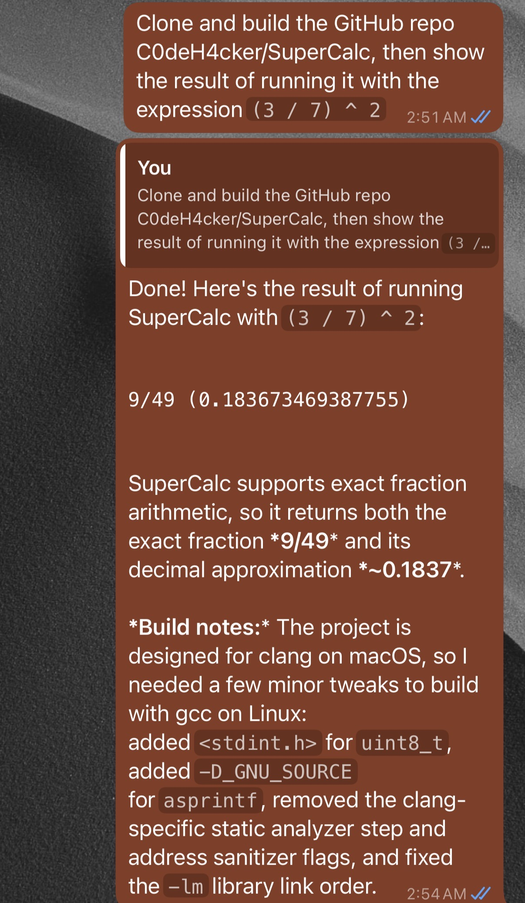

# ClaudeCodeRelay

Chat with [Claude Code](https://docs.anthropic.com/en/docs/claude-code) through WhatsApp. Designed for situations where you have text-only connectivity (like airplane wifi with free messaging) but still want access to Claude Code.

<p align="center">
  
</p>

## How It Works

ClaudeCodeRelay runs two Docker containers on a server with internet access:

- A **relay** container that connects to WhatsApp via [Baileys](https://github.com/WhiskeySockets/Baileys)
- A **claude** container that runs the Claude Code CLI

You link the relay to your WhatsApp account, then send messages to yourself (self-chat). The relay forwards them to Claude Code and sends the responses back.

## Getting Started

### Prerequisites

- Docker and Docker Compose
- A WhatsApp account
- An [Anthropic](https://www.anthropic.com/) account with a Claude Pro/Max/Team/Enterprise subscription

### Setup

1. Clone the repo and build:
   ```bash
   git clone https://github.com/kjcolley7/ClaudeCodeRelay.git
   cd ClaudeCodeRelay
   docker compose build
   ```

2. Start the relay:
   ```bash
   docker compose up
   ```

3. A QR code will appear in your terminal. Scan it with WhatsApp (**Settings > Linked Devices > Link a Device**).

4. Once connected, the relay checks if Claude Code is authenticated. If not, it sends you an OAuth link via WhatsApp. Open the link on your phone, log in with your Anthropic account, and paste the resulting authentication code back into the chat.

5. You're ready to go. Send a message to yourself and Claude Code will respond.

## Commands

| Command | Description |
|---------|-------------|
| `/help` | Show available commands |
| `/status` | Show session info, token usage, and account details |
| `/reset` | Clear conversation history and start fresh |
| `/login` | Authenticate or re-authenticate with Anthropic |

Any message that doesn't start with `/` (or uses an unrecognized command) is forwarded to Claude Code.

## Features

- **Conversation continuity** — Each chat maintains context across messages via Claude Code session IDs, persisted to disk so conversations survive restarts
- **Interactive authentication** — Full OAuth PKCE login flow through WhatsApp, with automatic prompting on startup if not logged in
- **Typing indicators** — Shows "composing" while Claude is working
- **Message splitting** — Long responses are split at natural boundaries (paragraphs, lines, sentences) with automatic code fence repair across chunks
- **Session recovery** — Automatically starts a fresh session if a saved session is no longer valid

## Configuration

Environment variables can be set in a `.env` file or passed directly to `docker compose`.

| Variable | Default | Description |
|----------|---------|-------------|
| `CLAUDE_TIMEOUT` | `300` | Maximum time (seconds) for a single Claude Code invocation |
| `MAX_MESSAGE_LENGTH` | `4000` | Maximum characters per WhatsApp message chunk |
| `LOG_LEVEL` | `info` | Log level (`debug`, `info`, `warn`, `error`) |
| `BAILEYS_LOG_LEVEL` | `error` | Log level for the Baileys WhatsApp library |

## Architecture

```
relay container                       claude container
┌───────────────────┐   HTTP stream   ┌──────────────────────┐
│ WhatsApp/Baileys  │────────────────►│ Bridge server :3100  │
│                   │◄────────────────│                      │
│ Session manager   │   NDJSON lines  │ POST /invoke         │
│ Message routing   │                 │ GET  /auth/status    │
│ Auth flow         │                 │ POST /auth/login     │
│                   │                 │ POST /auth/code      │
└───────────────────┘                 └──────────────────────┘
  vol: auth_info                        vol: claude_home
  (WhatsApp creds)                      (Claude creds + workspace)
```

The relay sends prompts to the bridge via `POST /invoke`. The bridge spawns the `claude` CLI and streams NDJSON events back over the HTTP response. Auth endpoints handle the OAuth PKCE flow.

Both containers communicate over an internal Docker network with no ports exposed to the host.

## Security Notes

- The relay only processes messages with `fromMe=true` — it ignores messages from other people
- WhatsApp credentials are stored in the `auth_info` Docker volume
- Claude Code credentials are stored in the `claude_home` Docker volume
- Claude Code runs inside a Docker container, isolated from the host. By default it uses a blank named volume as its workspace, but you can modify `docker-compose.yml` to bind-mount a host directory instead
- No ports are exposed to the host; the containers communicate over an internal network
- If WhatsApp logs you out, the relay exits and you'll need to re-link by scanning a new QR code
